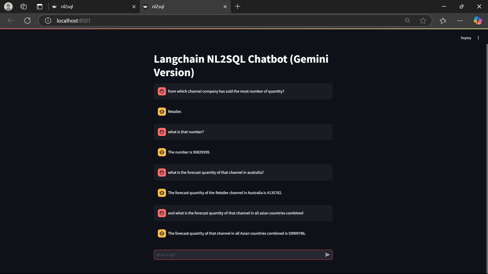

# Chat With Database (NL2SQL)

This is a Streamlit-based conversational AI application that translates natural language queries into SQL statements and retrieves relevant answers from a connected database.

The app utilizes LangChain agents along with SQLDatabaseChain to provide seamless interaction with databases using plain English. It features a customizable interface and streaming responses, making data querying more intuitive for non-technical users.

<details open="open">
  <summary>Table of Contents</summary>
  <ol>
    <li><a href="#Approach">Approach</a></li>
    <li><a href="#Features">Features</a></li>
    <li><a href="#Technologies">Technologies</a></li>
    <li><a href="#Prototype">Prototype</a></li>
    <li><a href="#How-to-Start-Project">How to Start Project</a></li>
    <li><a href="#Contact-Us">Contact Us</a></li>
  </ol>
</details>

## Approach

- The project implements an NL2SQL system using LangChain's `SQLDatabaseChain`, which parses natural language queries and converts them into executable SQL statements.
- The application leverages Gemini's API with the gemini-1.5-flash model for interpreting queries and generating accurate SQL based on the underlying database schema.
- Streamlit serves as the user interface, allowing real-time querying with response streaming and SQL output visibility for educational or debugging purposes.

## Features

- **Natural Language to SQL Translation:** Ask questions in plain English, and the system automatically generates and executes SQL queries.
- **Database Connectivity:** Connect to SQLite, PostgreSQL, MySQL, or any SQL-compatible database easily.
- **Interactive UI:** Streamlit-powered frontend with a query box, streaming answer display, and optional SQL preview.
- **Schema-Aware Agent:** The model understands the structure of your database to provide accurate results.

## Technologies

- Python
- Streamlit
- LangChain
- SQLAlchemy
- Gemini API 
- SQLite/PostgreSQL/MySQL (any standard SQL DB)

## Prototype

<div style="display:flex; flex-wrap:wrap; gap:2%; justify-content:center;">



## How to Start Project

Follow these steps to get started with the project:

1. **Clone the Repository:**

   ```bash
   git clone <repository_link>

2. **Install Anaconda:**
   
   Make sure you have Anaconda installed on your system. If not, you can download and install it from the official website: https://www.anaconda.com/download/
   
4. **Create a Virtual Environment:**
   
   Create a new virtual environment using Python 3.8:

   ```bash
   conda create --name your_env_name python=3.10 -y

   ```
   Replace your_env_name with the desired name for your virtual environment.
   
   Activate the newly created environment:
   ```bash
   conda activate your_env_name
   ```
5. **Install Dependencies:**
   
   Install the project dependencies by running:
   ```bash
   pip install -r requirements.txt
   ```
   This command will install all the required packages listed in the requirements.txt file.

6. **Set API Key**

    Put your API keys of langchain, gemini and database host, username, password, database name into .env file

7. **Run the Streamlit App:**

   ```bash
   python run.py
   ```
   This command will start the Streamlit app.


## Contact Us

To learn more about, please reach out:

📧 suzalkachhadiya111@gmail.com